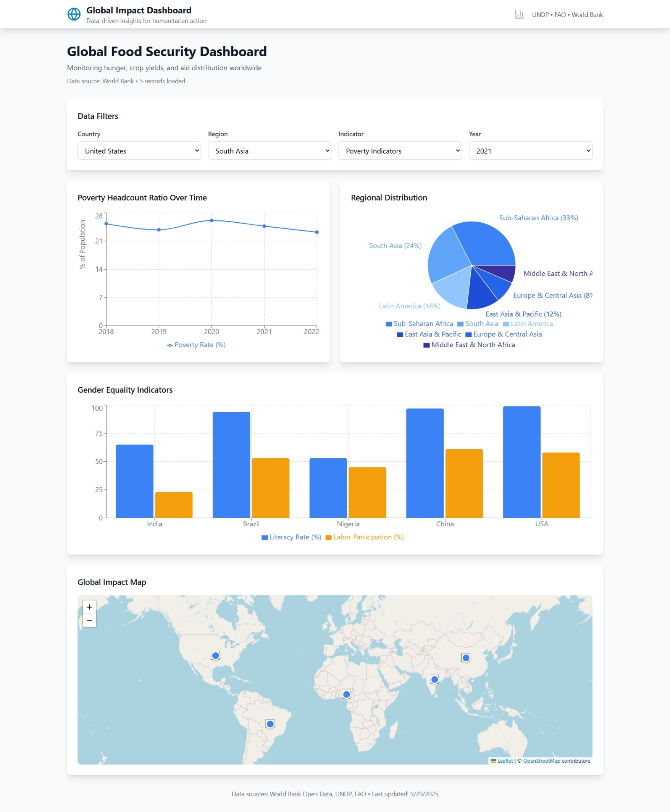
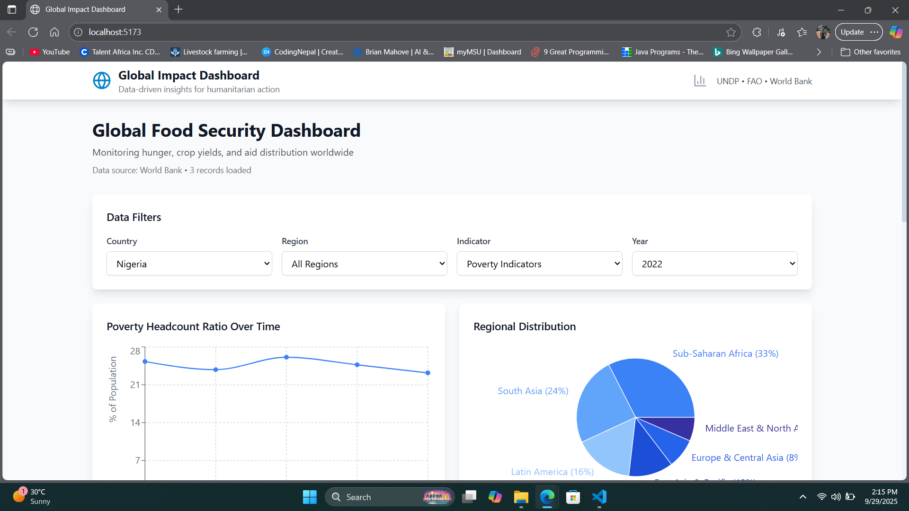
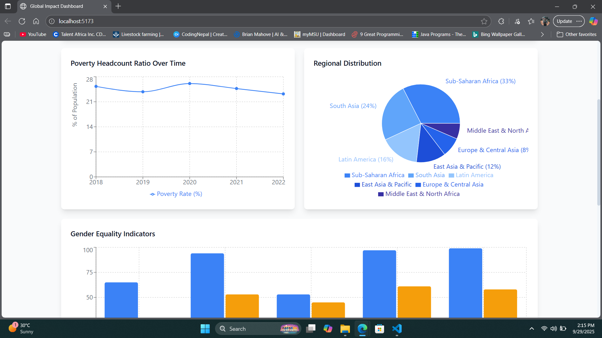
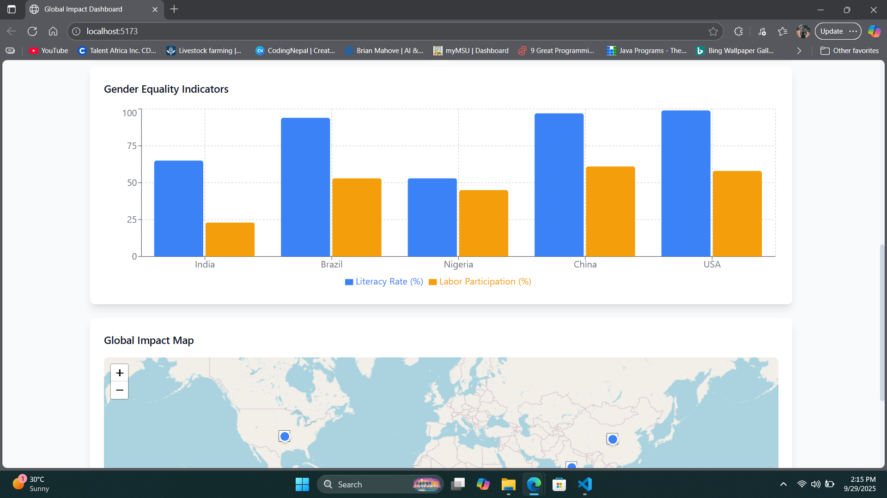
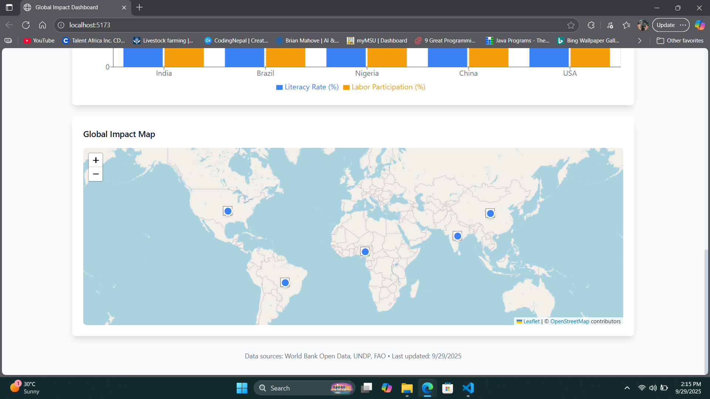

# 🌍 Social Impact Data Visualization Dashboard

A comprehensive, interactive dashboard for visualizing global development data from international organizations like UNDP, FAO, and World Bank. Built with modern web technologies to make complex data accessible and actionable.

   

## 🚀 Screenshots






## 🚀 Live Demo

**Frontend**: [https://your-demo-link.netlify.app](https://your-demo-link.netlify.app)  
**Backend API**: [https://your-api-link.railway.app](https://your-api-link.railway.app)

## 📊 Features

### 🎯 Core Functionality
- **Interactive Data Visualizations**: Line charts, bar charts, pie charts, and maps
- **Real-time Data Filtering**: Filter by country, region, year, and development indicators
- **World Map Integration**: Geographic visualization with Leaflet.js
- **Mobile-Responsive Design**: Works seamlessly across all devices
- **SQLite Database**: Lightweight, file-based database with sample data

### 📈 Data Insights
- Poverty headcount ratios and trends
- Gender equality indicators
- Regional development comparisons
- Sustainable Development Goal tracking
- Custom data analysis and personal insights

### 🛠 Technical Features
- Modern React.js frontend with hooks and context
- Express.js backend with RESTful API
- Real-time data updates
- Export functionality for analysis
- Personal notes and goals tracking

## 🏗 Tech Stack

### Frontend
- **React.js 18** - Modern UI framework
- **Recharts** - Data visualization library
- **Leaflet/React-Leaflet** - Interactive maps
- **TailwindCSS** - Utility-first CSS framework
- **Lucide React** - Beautiful icons
- **Vite** - Fast build tool

### Backend
- **Node.js** - Runtime environment
- **Express.js** - Web framework
- **SQLite** - Database
- **CORS** - Cross-origin resource sharing
- **Axios** - HTTP client

### Deployment
- **Frontend**: Vercel/Netlify
- **Backend**: Railway/Render
- **Database**: SQLite (file-based)

## 🚀 Quick Start

### Prerequisites
- Node.js 18+ 
- npm or yarn

### Installation

1. **Clone the repository**
```bash
git clone https://github.com/yourusername/social-impact-dashboard.git
cd social-impact-dashboard
```

2. **Setup Backend**
```bash
cd backend
npm install

# Initialize database with sample data
npm run init-db

# Start development server
npm run dev
```

3. **Setup Frontend**
```bash
cd frontend
npm install
npm run dev
```

4. **Access the Application**
- Frontend: http://localhost:5173
- Backend API: http://localhost:3001
- API Health Check: http://localhost:3001/api/health

## 📁 Project Structure

```
social-impact-dashboard/
├── frontend/                 # React.js frontend
│   ├── src/
│   │   ├── components/       # Reusable components
│   │   │   ├── Charts/       # Data visualization components
│   │   │   ├── Maps/         # Map components
│   │   │   ├── Filters/      # Filter components
│   │   │   └── Layout/       # Layout components
│   │   ├── pages/           # Page components
│   │   ├── context/         # React context for state management
│   │   ├── utils/           # Utility functions and API calls
│   │   └── styles/          # CSS and styling
│   └── package.json
├── backend/                  # Node.js backend
│   ├── routes/              # API routes
│   ├── controllers/         # Route controllers
│   ├── database/           # Database configuration and initialization
│   └── package.json
└── README.md
```

## 🗃 Database Schema

The SQLite database includes:

- **countries**: Country metadata (name, region, coordinates)
- **indicators**: Development indicators and metadata
- **indicator_data**: Time-series data for indicators

Sample data includes poverty rates, literacy rates, life expectancy, and GDP per capita for multiple countries and years.

## 🔌 API Endpoints

### Data Endpoints
- `GET /api/data/worldbank` - World Bank indicator data
- `GET /api/data/undp` - UNDP development data
- `GET /api/data/countries` - Country list and metadata
- `GET /api/data/dashboard` - Complete dashboard data

### Utility Endpoints
- `GET /api/health` - API health check
- `GET /api/db-info` - Database information

## 🎨 Customization

### Adding New Indicators
1. Add indicator to `backend/database/db.js`
2. Update API controllers
3. Create new chart component in frontend
4. Add to filter options

### Styling
- Modify `tailwind.config.js` for color schemes
- Update CSS in `src/styles/` for custom styling
- Add new animation keyframes as needed

### Personalization
- Add your focus countries in filter components
- Include personal notes and goals panels
- Customize the dashboard header with your information

## 🌐 Deployment

### Frontend (Vercel/Netlify)
```bash
cd frontend
npm run build
# Deploy the dist folder to your hosting service
```

### Backend (Railway/Render)
```bash
cd backend
# Connect your repository to deployment service
# Set environment variables if needed
```

## 📊 Data Sources

This project uses sample data simulating:
- **World Bank Open Data API**
- **UN Sustainable Development Goals API** 
- **FAO Statistical Database**

*Note: Replace sample data with real API integrations for production use.*

## 🤝 Contributing

We welcome contributions! Please see our [Contributing Guide](CONTRIBUTING.md) for details.

1. Fork the repository
2. Create a feature branch (`git checkout -b feature/amazing-feature`)
3. Commit your changes (`git commit -m 'Add some amazing feature'`)
4. Push to the branch (`git push origin feature/amazing-feature`)
5. Open a Pull Request

## 🐛 Troubleshooting

### Common Issues

**Frontend not loading:**
- Check if backend is running on port 3001
- Verify all dependencies are installed
- Check browser console for errors

**Charts not displaying:**
- Ensure Recharts is properly installed
- Check data format in API responses
- Verify component imports

**Database issues:**
- Run `npm run init-db` to reset database
- Check file permissions for SQLite file
- Verify database path in configuration

## 📄 License

This project is licensed under the MIT License - see the [LICENSE](LICENSE) file for details.

## 🙏 Acknowledgments

- Data sources: World Bank, UNDP, FAO
- Icons: [Lucide React](https://lucide.dev)
- Maps: [Leaflet](https://leafletjs.com) and [OpenStreetMap](https://www.openstreetmap.org)
- Charts: [Recharts](https://recharts.org)

## 📞 Contact

**Your Name** - [your.email@example.com](mailto:your.email@example.com)

Project Link: [https://github.com/yourusername/social-impact-dashboard](https://github.com/yourusername/social-impact-dashboard)

## 🔮 Future Enhancements

- [ ] Real-time data from live APIs
- [ ] User authentication and saved dashboards
- [ ] Advanced analytics and forecasting
- [ ] PDF report generation
- [ ] Multi-language support
- [ ] Dark mode theme
- [ ] Data import/export functionality

---

<div align="center">

**Built with ❤️ for better data-driven decisions**

*Making global development data accessible to everyone*

</div>

## 📋 Project Status

| Component | Status | Version |
|-----------|--------|---------|
| Frontend | ✅ Complete | 1.0.0 |
| Backend API | ✅ Complete | 1.0.0 |
| Database | ✅ Complete | 1.0.0 |
| Documentation | ✅ Complete | 1.0.0 |
| Deployment | 🟡 In Progress | - |

---

⭐ **If you find this project useful, please give it a star!** ⭐

